## Selecting a search area

Before you start, you need to select the area in which you want to find objects

- Click on the square in the upper right corner of the map
  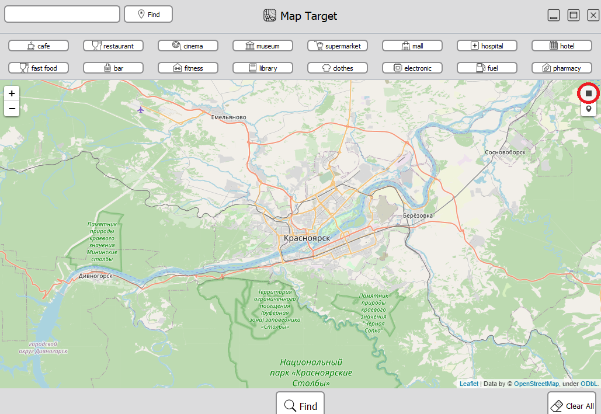

- Highlight the area of interest to you
  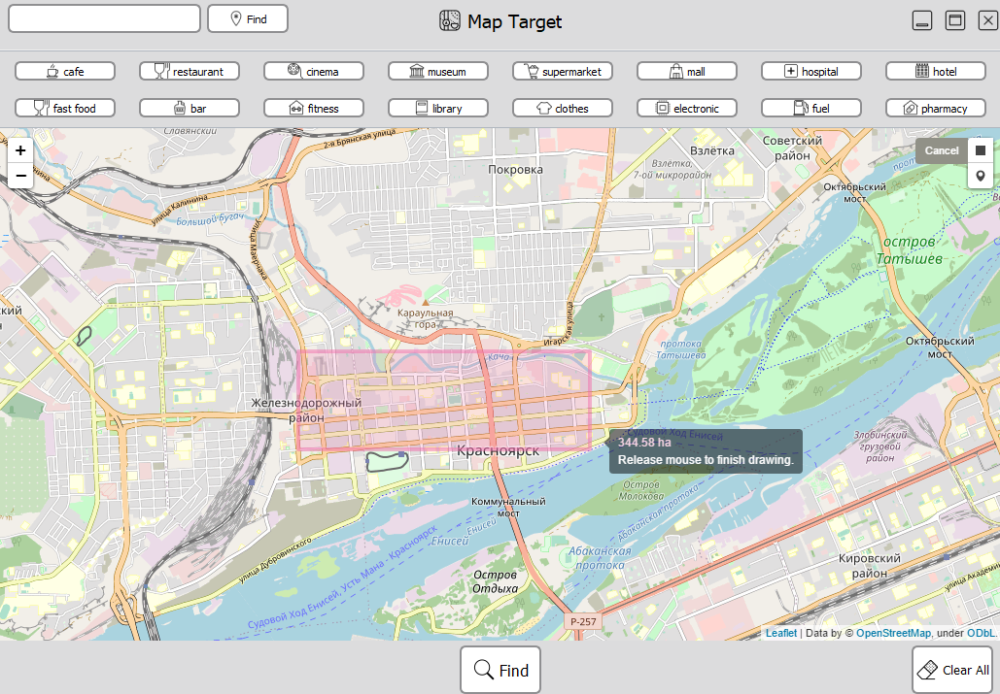

## Object Search

Now you can find objects of interest in this area

- Searching Standard Objects. Click on one of the. **After** you click, the search will start
  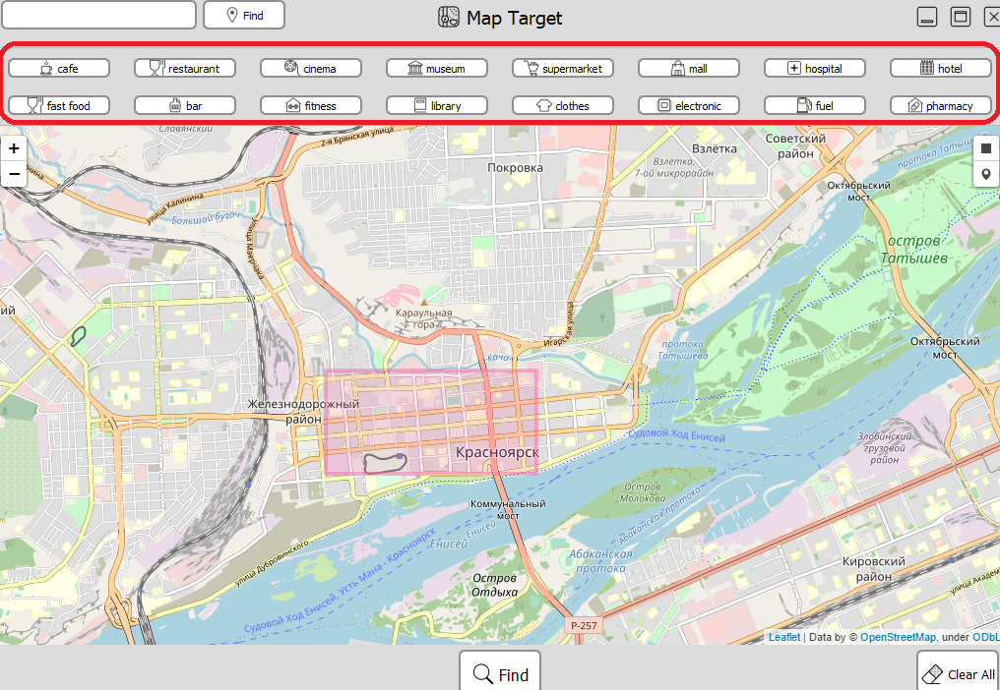

- Search by name. Enter a name on this line.
  **After** you finish typing, click on find, to the right of the input line, and then the search will start
  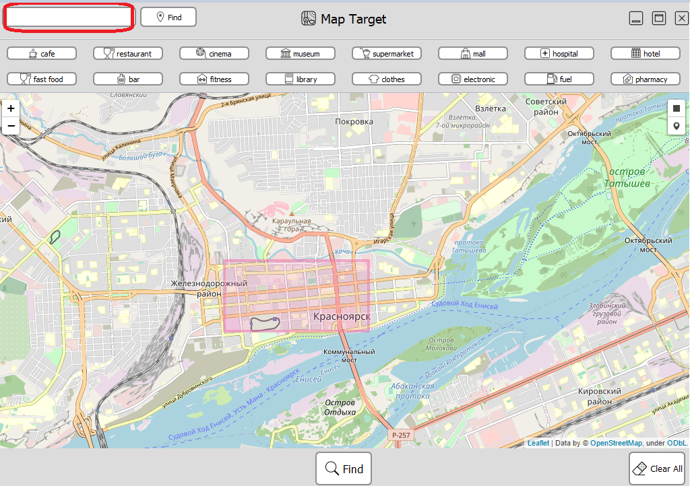

- After completing the search, you will see about the following
  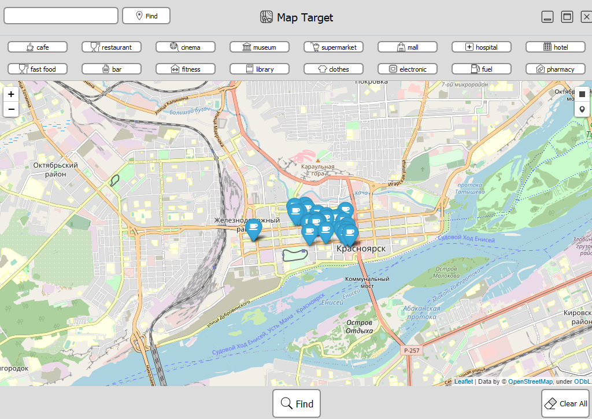

## Search nearest object

After finding objects, you can start searching for the nearest object

- Click the button in the upper right corner of the map
  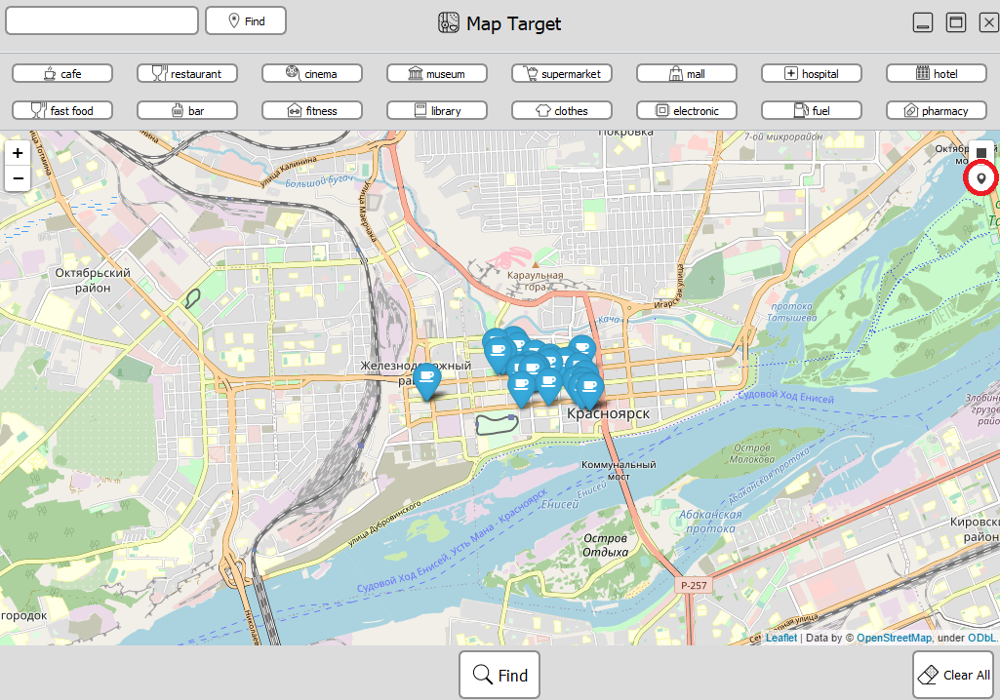

- Set the marker to the point you want to find the nearest object
  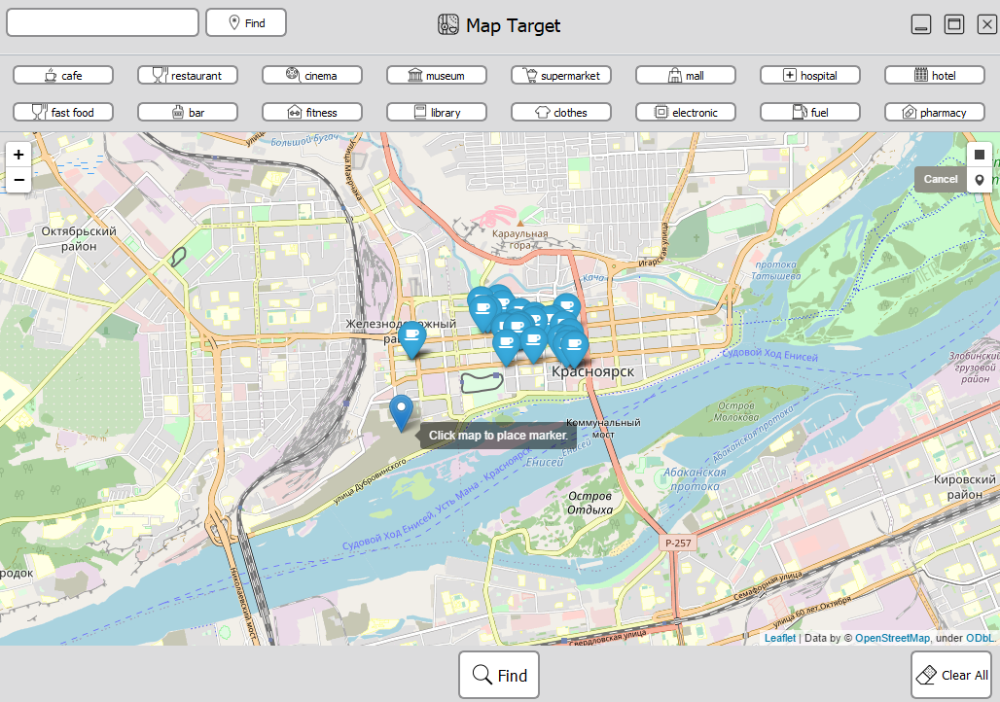

- After that, click on the find button at the bottom of the application
  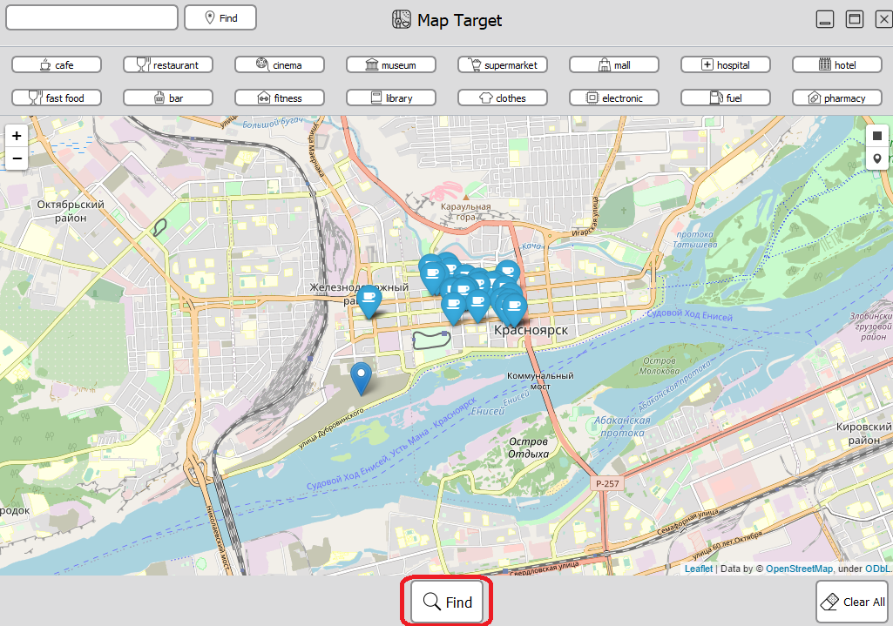

- After clicking, the nearest object will be marked
  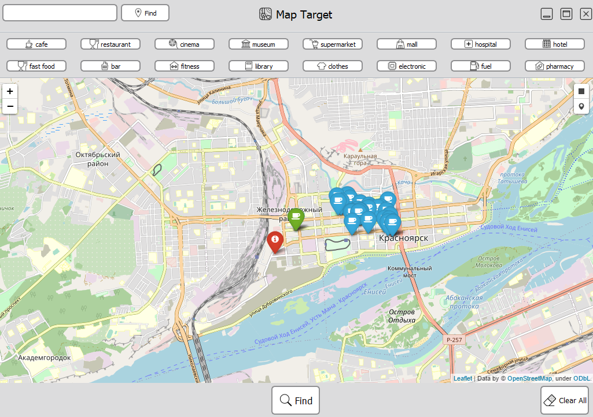

## Cleaning the map

- To clear the map, click clear all
  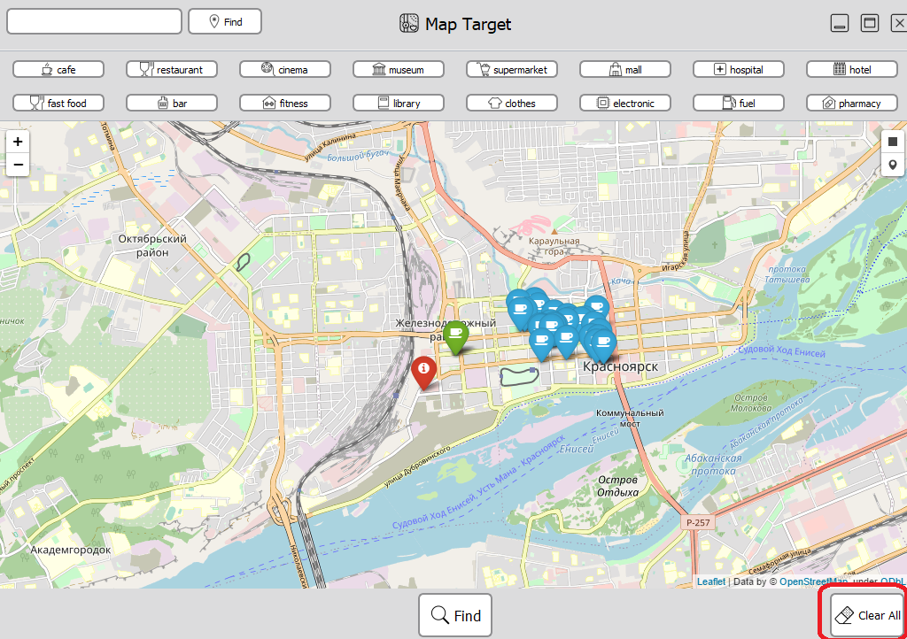

- You will get
  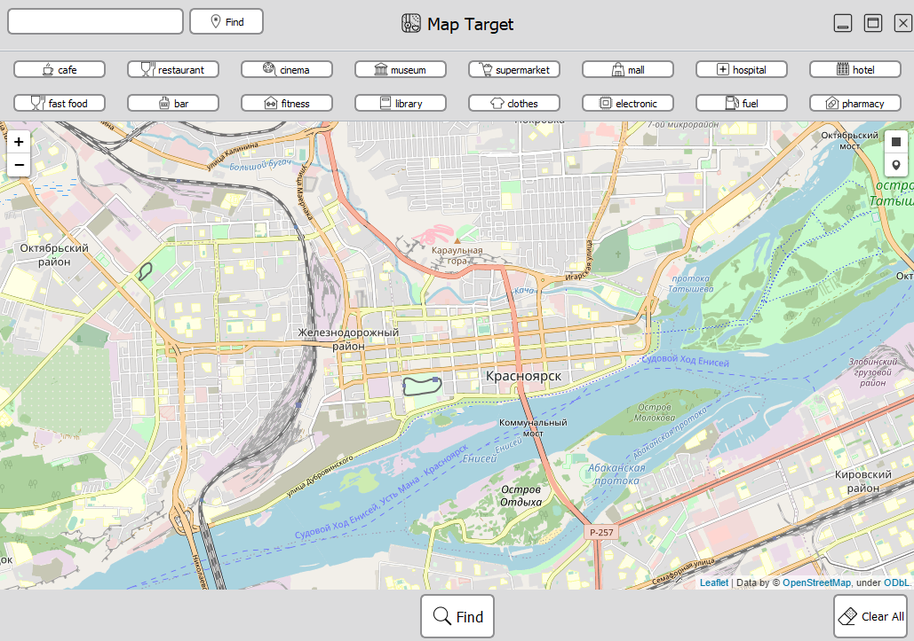